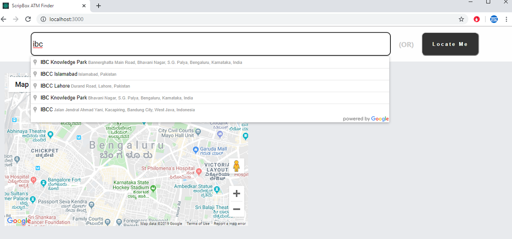
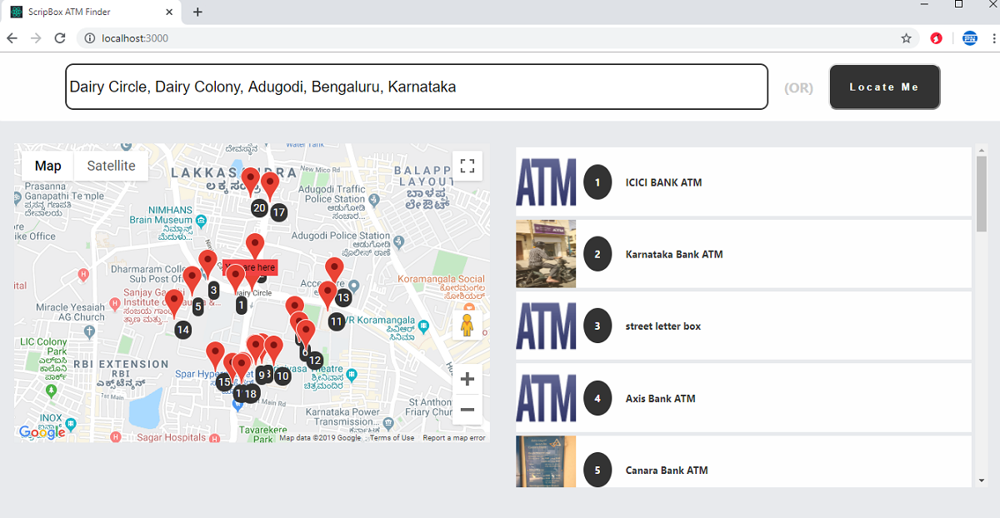

## ATM Finder (React Demo With Google Maps)

A small and concise React app built using Google's Maps, Locations and Places Autocomplete APIs.

### Screenshot

#### Places Search UI

 

#### Results UI

                 

### Steps to run

The application needs a working API key for Google Maps and Goolge Place API.
Please, add the key to the ENV file with the name `REACT_APP_MAP_API_KEY`.

After that,
please run the following commands:

`yarn instal`

    or

`npm install`

`yarn start`

or

`npm start`
